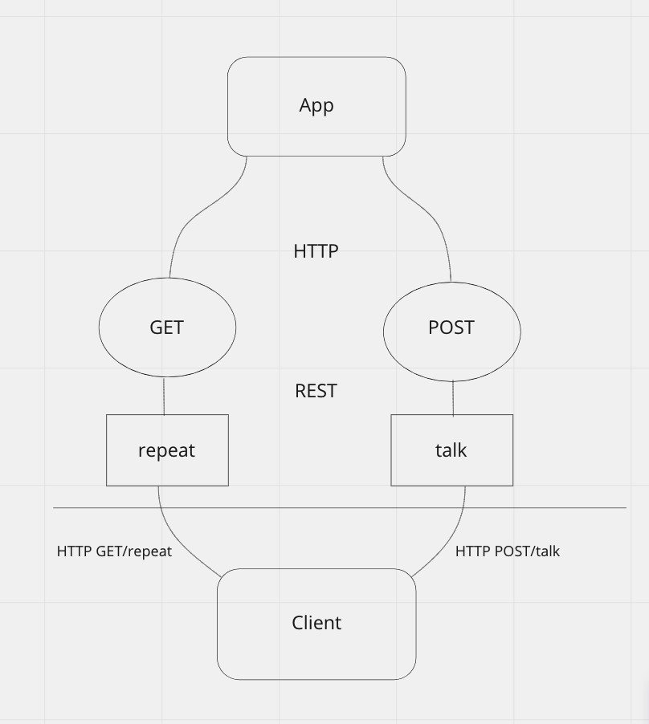

# Express Server

Created by Sarah Creager

## Installation
`npm install`

## Dependencies
 * dotenv
 * express
 * jest
 * supertest

## Summary of Problem Domain
Build server and deploy to Heroku.

## Links to application deployment
[Heroku Dev](https://sarah-server-deploy-dev.herokuapp.com/)

[Heroku Production](https://sarah-server-deploy-prod.herokuapp.com/)

## UML

## Routes

* HTTP GET
  * Path: /repeat
    * responds with the last string used in post route `/talk`.

* HTTP POST
  * Path: /talk
    * Accepts a string.
    * responds with a string.